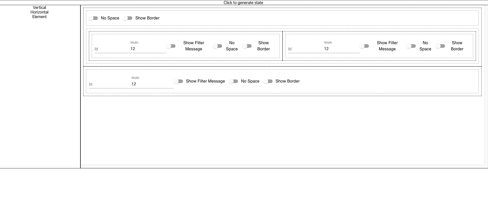
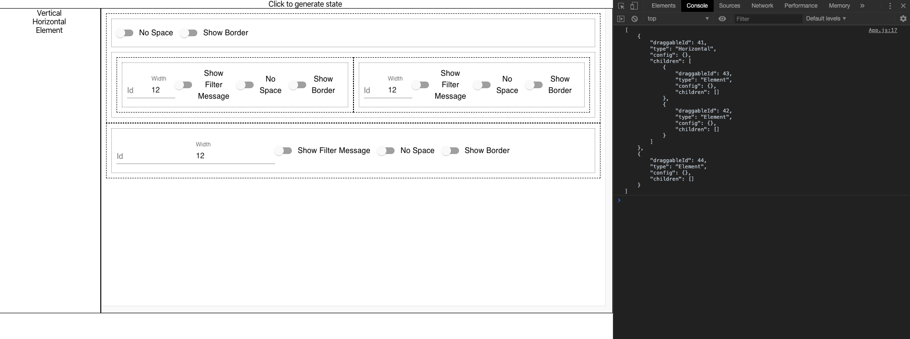

This is the last part of the 2 part blog, where I share my experience in putting together a configuration driven user interface.

The solution consisted of 2 parts, first an UI that is generated by configuration and second an admin screen where a user can drag and drop to build the configuration.

In [Part 1](https://techmusings.dev/buildingAConfigDrivenUiInReactPart1) we looked at first part of the solution on how a JSON configuration drive the UI generation, this blog talks about how we built a configuration generation UI using DnD components to help generate the JSON configuration.

## TL;DR

The Drag and Drop UI was built using [React Beautiful DnD](https://github.com/atlassian/react-beautiful-dnd). The solution consisted of 3 types of components Horizontal, Vertical and a Leaf( Element) The Horizontal and Vertical let's the user to stack items inside them.
We can also add different types of leaf components and ultimately help generate the configuration required. The rest of the blog talks about how we managed to build the same. 


## Continuing from where we left

As mentioned in the part 1 of the blog, the need is to generate a recursive structure that would stack different types of components indside them.  In our case we needed 3 types

1. Horizontal - To stack items besides each other 
2. Vertical - To stack items one below the other
3. Element - The actual elemement that would be translated to a visualization/ form or any such type of component. 

To makes things simple, we wanted to keep the UI as intutuve as possible and also try to provide the ease of constructing the same.
We wanted to make the whole thing a Drag and Drop based UI. Searching for many react libraries, we found that [React Beautiful DnD](https://github.com/atlassian/react-beautiful-dnd) was a great fit for our requirement as it was heavily customizable. 

## The Version 1

The solution consisted of 2 panes. A LHS pane which had 3 components Vertical, Horizontal and Element, an RHS pane which would help the user build their UI. Before I explain further our solution a quick background on how the components for React Beautiful DnD would be organized. 

1. At a high level we will have a DragAndDropContext. This should be the parent component for all the other components that needs to work together. 

2. A Draggable component that helps you build components that you can drag around

3. A Droppable component into which you can add the dragged components. 

4. Inside of the Droppable component we use a state to draw the complete structure of draggable and droppable components recursively.


As mentioned above, we maintain a recursive state, synonymous to the recursive JSON that is required to be generated. For the LHS, we created 3 components, Vertical, Horizontal and Element. 

Since each of them apart from holding an ID for themselves also had confgurations (like the color and the width of the block for example), it had a form being put inside them. The draggable that get's drawn inside the droppable would just paint what every was inside this component based on the type that is dragged and dropped.

The final UI looked something like below. 




## Using the Version 1

For using the first version it was quite simple, one needs to use the component `LayoutDesigner`, to which they will pass 2 parameters. 

1. uiLayout: This is the JSON structure that is based on the one defined in part1 of the blog. The recursive structure that build the UI. This is particularly useful when one needs to edit an existing page. For all new creates a null can be passed. 

2. onComplete: This takes a function that has an input of "result" which is the JSON configuration generated.  The current UI has a button called generate config, that would inturn pass the internal state to this onComplete function and the side effecting can be handled that way. We saved the JSON to a backend so that it can be retrieved later for drawing a dashboard in a different application in this particular callback function. The click generates a JSON as shown in the image below




We leveraged the above solution and were able to generate the JSON without any issues. Until the next change came in.


## The New Change

The customer were happy that they did not have to be too technical to understand this and were able to generate the json configuration easily. But they realised that they had different types of Element nodes. Example, one of them showed a visualization, another just a heading and another another a table etc. 

They were able to handle the rendering of the same in the dashboard UI using the handleTypes. But each type only required certain configurations and not all of them. While trying to build the configuration here, they made changes to the Element object that would have fields to capture values for all the different types which made the whole form look very complex and confusing. 

So the request came in the form have having different components in the LHS that each corresponds to a specific type of Element node. 
For example the LHS would now be having 
* Vertical
* Horizontal
* Title
* Plot
* Table 

## Buliding of Version 2

The version 1 was adequate, but did not scale to the new requirements as the Element, Vertical and Horizontal were hard coded and many of it's state modifications were also hard coded based on their types such as "ELEMENT".

We had to work on making this totally configurable. To start with we segregated the nodes into 2 major types, A Leaf and a non Leaf. 
Horizontal and Vertical are non-leaf nodes which means they allow nested structures inside them, and the other nodes such as Plot/ Title were leaf nodes. 

The other need was to help them build the contents of the nodes. It needs to be shown on the LHS ( they can choose to use an Icon instead of simple string) and also draw the corresponding form on the RHS. Each of these forms can be unique depending on the specific type. 

So we came up with a common class called the ElementDefinition with the following constructor params. 

| Property        | Description                                                                                                                   |
| --------------- | ----------------------------------------------------------------------------------------------------------------------------- |
| id              | an unique string to identify the node                                                                                         |
| type            | the type to be set while generating the actual JSON config                                                                    |
| isLeaf          | A boolean that says if it's a leaf or not                                                                                     | 
| buildRHSElement | A function that takes in the current config of the node and it's update method and inturn returns the Form to be shown        | 
| buildLHSElement | A function that taken in React Beautiful DnD provider and returns a node that needs to be shown in the LHS                    |

Using this class as the base class, we went ahead and created separate implementations for Vertical , Horizontal, Polt, Title and Table. 
Now the `LayoutDesigner` component takes an extra parameter called `definitions` which is an array of all the ElementDefinitions. It looks like below.  A sample implementation of a [ChildElement](https://github.com/arunmadhavan-g/multi-level-dnd/blob/master/src/config/ChildElementDefinition.js) can be referred from here. 

```
 <LayoutDesigner uiLayout={null}
                  definitions={[
                      new VerticalElementDefinition(),
                      new HorizontalElementDefinition(),
                      new ChildElementDefinition()
                  ]}
                  onComplete={result => console.log(JSON.stringify(result, null, 4))}/>
```


## Summary

Finally the use our application the following were required to be done. 

1. Define each of the ElementDefinition
2. Pass them as inputs to the `LayoutDesigner` ( Refer [App.js](https://github.com/arunmadhavan-g/multi-level-dnd/blob/master/src/App.js) )
3. Sideeffect (like persist to a backend ) the generated JSON using the `onComplete` call back


## Next Steps

We are currently working on making both the DnD and the Configuration driven UI as NPM packages to other to use and the code is already opensourced. We welcome for people to contribute as well and an official announcement will be made in my next post.  Stay tuned.

